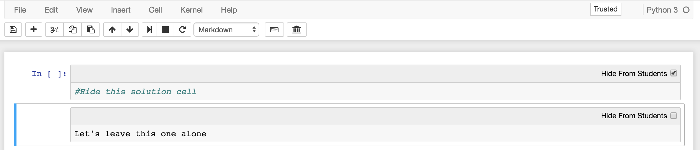

# nbsolutions



NB Solutions is a Jupyter notebook extension that allows the user to mark cells
as 'solution' cells not meant to be viewed by students. It also adds a toolbar
button that opens 'Student View', and hides all marked cells in the current
notebook. Accessed through View -> Cell Toolbar -> Student Solutions.

## Installation

Using pip (add --sys-prefix if installing in local environment):

```
pip install nbsolutions
jupyter nbextension install --py nbsolutions (--sys-prefix)
```

To enable this extension for all notebooks:

```
jupyter nbextension enable --py nbsolutions (--sys-prefix)
```
